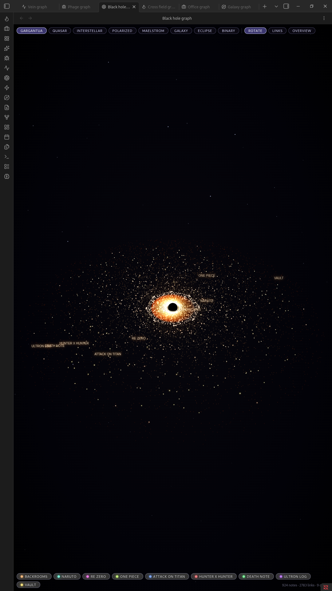
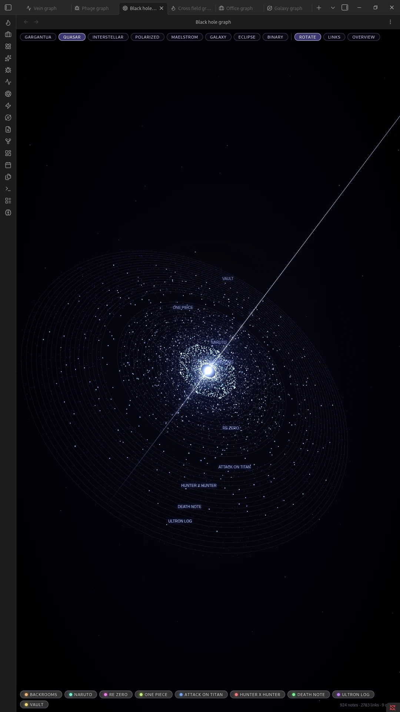
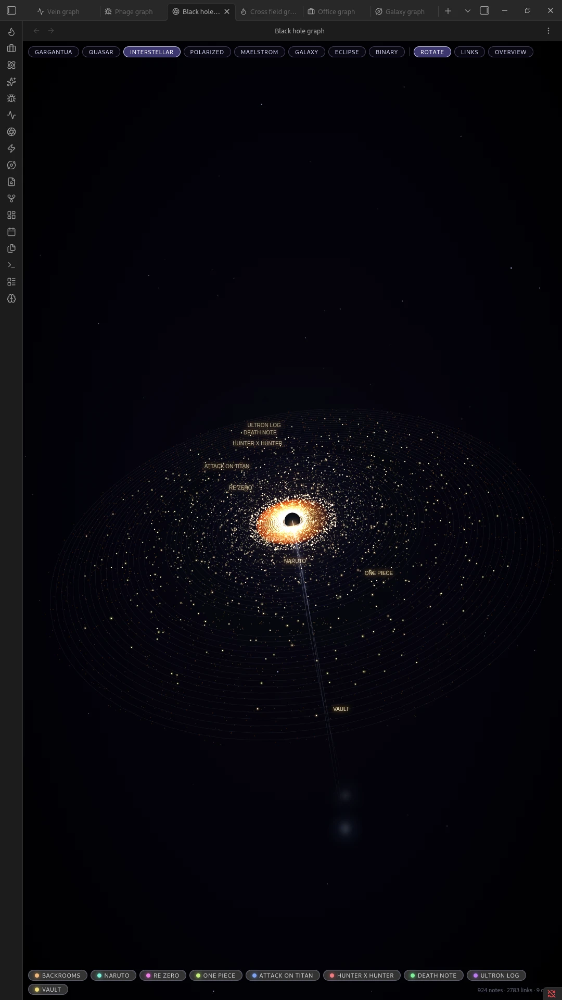
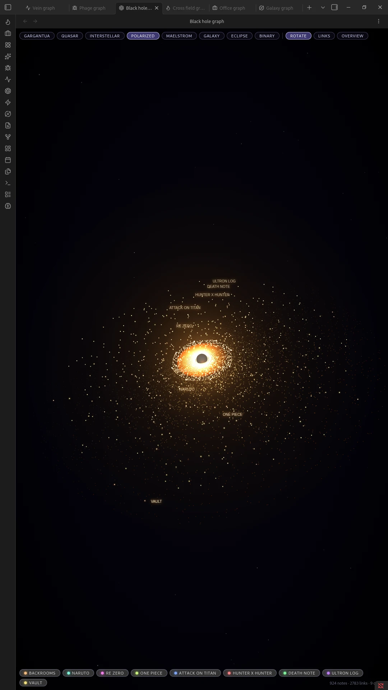
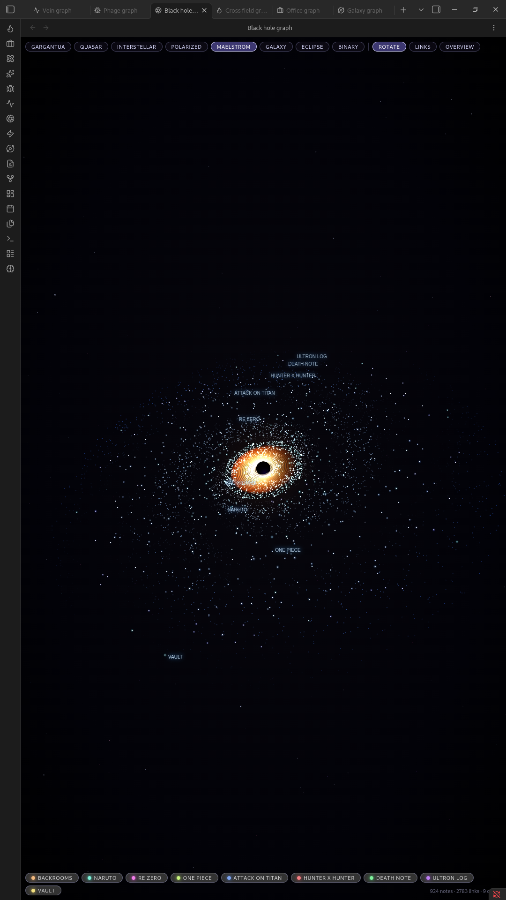
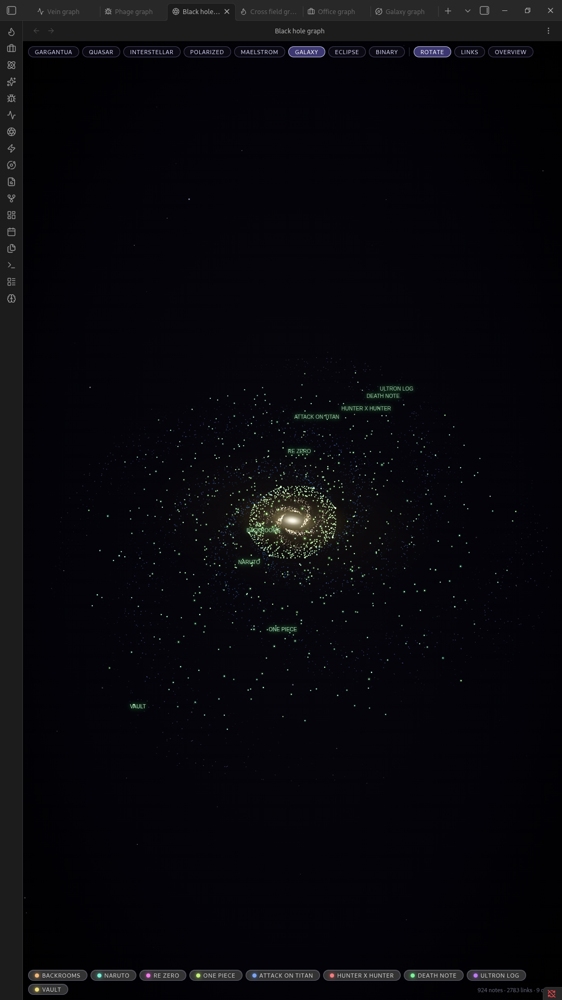
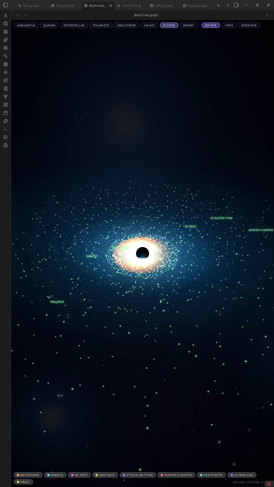
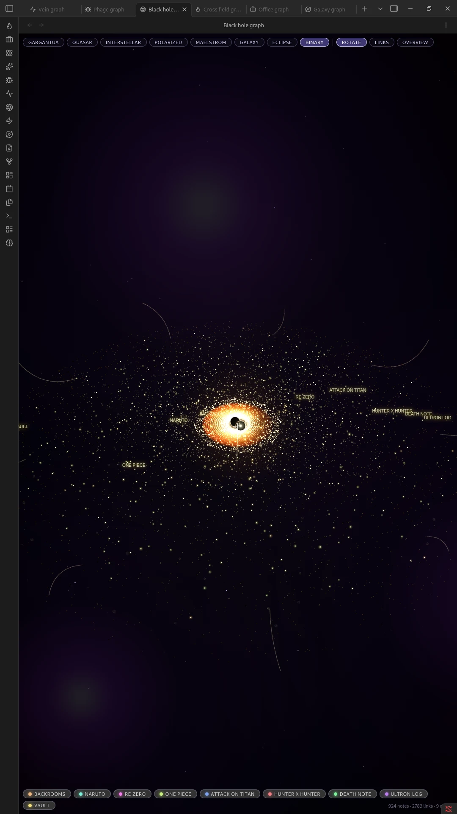

# Black Hole Graph

Turns your Obsidian graph view into a black hole. Every top-level folder becomes an orbit in the accretion disc; every note becomes a star in that orbit. Notes that link to each other are pulled visually closer within the disc.

Pan and zoom the scene, click a folder's orbit to focus on it, and click any star to open its note.

## Looks

The plugin ships with eight visual modes you can switch between from the toolbar, each restyling the same underlying data:

### Gargantua
The warped, lensed ring look of the black hole from *Interstellar*.

### Quasar
A bright, energetic core with jets.

### Interstellar
A softer, more naturalistic version of Gargantua.

### Polarized
A high-contrast, sharply banded disc.

### Maelstrom
A swirling, turbulent disc with heavy motion.

### Galaxy
A spiral-armed galaxy instead of a single hole.

### Eclipse
A silvery, backlit ring.

### Binary
Two black holes orbiting each other.

## Installation

### Manual

1. Download `main.js`, `manifest.json`, and `styles.css` from the [latest release](../../releases/latest).
2. Create a folder named `black-hole-graph` inside your vault's `.obsidian/plugins/` directory.
3. Place the three downloaded files in that folder.
4. Reload Obsidian and enable **Black Hole Graph** under Settings → Community plugins.

### Community Plugins browser

Once accepted into Obsidian's directory, search for "Black Hole Graph" under Settings → Community plugins → Browse, and install it from there.

## Usage

- Open the graph with the ribbon icon, the command palette (`Open black hole graph`), or the toolbar.
- Drag to pan, scroll or pinch to zoom.
- Click a star to open its note.
- Click a folder label / orbit to focus the camera on that folder.
- Switch looks and toggle effects (links, motion, etc.) from the in-view toolbar.

## License

MIT, see [LICENSE](LICENSE).
